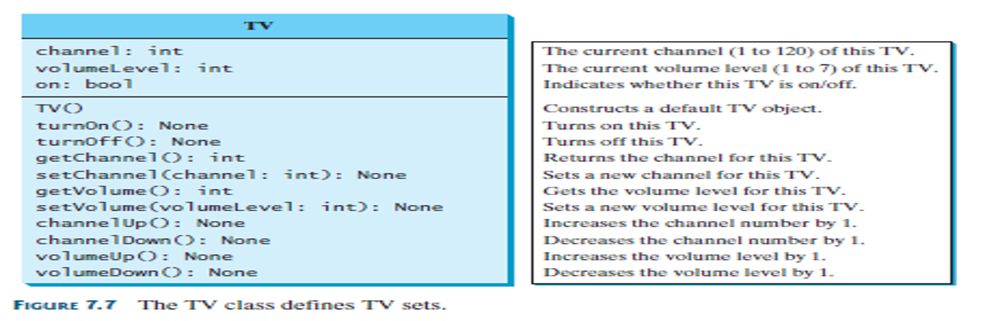
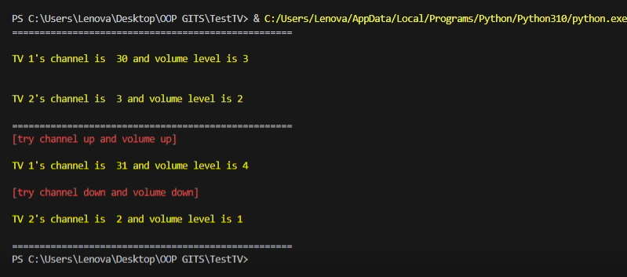

# TestTV

### Create a Python Code for creating the Class named TV and a Test Driver program named TestTV that will create two objects from Class TV

1. Create a class named TV
2. Use the given UML Class Diagram below:

3. Create another Python File as the Test Driver Program

# Example Output

# How To Use / Run
1. Install Python on your computer to run the code. You can download its latest version here: https://www.python.org/downloads/ 
2. Copy the code from the repository. 
3. Open an IDE and paste the code. 
4. Save the file with a .py extension. 
5. Run the code. 
